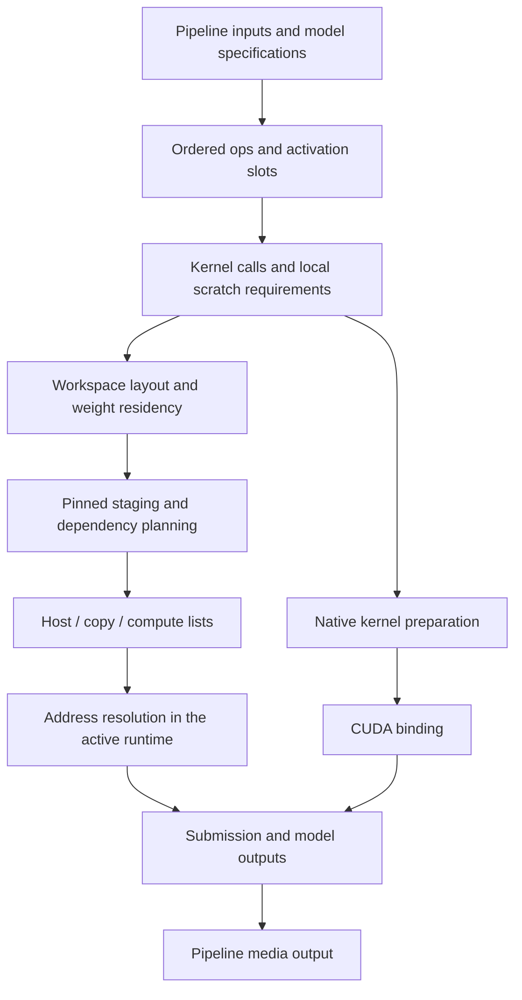

# Core architecture

[中文](../../zh/core/README.md)

`core` connects the kernel, op, model and pipeline layers. Its contracts let a
model describe computation and memory requirements first, then execute that
description with concrete checkpoint files, host buffers and CUDA addresses.

The layers have distinct scopes:

| Layer | Owns | Produces |
| --- | --- | --- |
| Kernel | One computation, its workload and compile-time choices | A configured launch and MMA operation counts |
| Op | Activation bindings, weight bindings and temporary regions | Ordered kernel calls and a scratch extent |
| Model | Model shapes, activation slots, ordered ops and checkpoint metadata | A memory plan and three ordered submission lists |
| Pipeline | Input preparation, model coordination and media output | Generated media and a description of the measured workload |

## Follow a generation

The pipeline resolves its assets and input shapes. Each model uses those shapes
to assemble ops and size its activation slots. Each op expands into kernel calls
whose arguments identify activation slices, weights and local scratch regions.
Planning places those regions, schedules weight uploads and establishes reuse
dependencies. Execution resolves the planned locations into addresses and
submits the resulting work.

The submission lists are part of the model plan. Kernel preparation can run
ahead of execution; a pipeline can prepare later models while an earlier model
runs. The runtime owns the CUDA context and shared arenas for the complete
generation, and each model invocation binds its inputs, outputs and checkpoint
paths for that invocation.

## Reading order

1. [Contracts](contracts.md) explains the public interfaces, binding syntax,
   abstract methods, preparation results and operation accounting. Start here
   when adding a kernel, op, model or pipeline.
2. [Storage](storage.md) follows activation IDs, byte offsets, weight references
   and scratch extents through workspace layout.
3. [Planning](planning.md) describes weight residency, pinned staging, dependency
   intervals and the construction of the three submission lists.
4. [Compilation](compilation.md) covers native TileLang preparation, CUDA
   binding and their interaction with execution.
5. [Runtime](runtime.md) explains buffer ownership, stream submission,
   synchronization and resource cleanup.

For a model change, read the contracts and storage pages together: the model
chooses activation reuse, and the op supplies the shapes and local temporary
requirements used by the planner. For a startup or synchronization investigation,
follow preparation through compilation and then inspect runtime ownership.

## Units and boundaries

Tensor shapes count elements. Activation offsets, scratch offsets, checkpoint
offsets and memory capacities count bytes. Kernel workload/configuration values
select computation variants; device addresses are supplied at execution.

Model plans retain logical operation counts alongside their kernel commands.
Measurement code combines those counts with hardware throughput and measured
latency. This keeps the same workload description available to execution,
per-kernel measurement and pipeline reports.

`core/kernel.py` defines complete MMA
instruction types and their logical operation counts. Each type names both
operands and the accumulator, so reports use the enum value directly.
