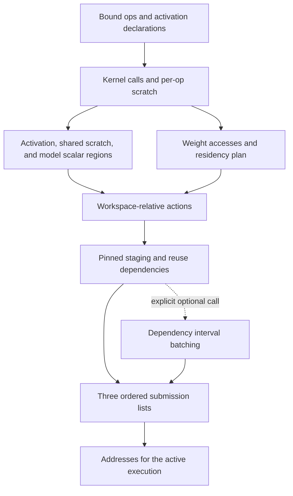

# Allocation and planning

[中文](../../zh/core/planning.md) · [Core guide](README.md)

Start with a bound `Op`: its inputs identify activation slices, its weights are
registry references, and `to()` supplies its output bindings. `Op.prepare()`
returns ordered `Kernel` objects plus that op's scratch extent. Planning turns
these descriptions into copies, kernels, and synchronization actions, places them
in three submission lists, and eventually resolves them against one execution's
buffers.

All capacities, copy lengths, and storage offsets below are **bytes**. Tensor
shapes remain element counts. A **kernel ordinal**, an **H2D-use ordinal**, and an
**action-list index** count different sequences; the planners translate between
them explicitly.



The normal model path calls `operators.commands()` during model planning,
`scheduling.plan_staging()` from `PlannedModel.read()` when `pinned_nbytes` is
provided, and `submission.build()` when constructing the model. `execute()`
enters the runtime and calls `addressing.address_plan()`. The batching interface
described below is available for explicit insertion before submission-list
construction; the current model read path does not invoke it.

## Workspace layout and operator lowering

Read [`operators.py`](../../../src/nano_omni/core/planning/operators.py), beginning
with `commands(operators, activations, registry, capacity, scalars)`. Its return value is
`(list[Action], CommandStatistics)`.

The function prepares every op in order, obtains the activation layout, and
reserves the largest op scratch extent rounded up to 256 bytes. Every op uses the
same scratch base because its kernel calls retain their compute-stream order.
The optional `ScalarLayout` packs small read-only values built by the model and
uploads each interned region once. The remaining workspace forms the weight arena:

```text
activation region: [0, activation_bytes)
scratch region:    [activation_bytes, scalar_base)
scalar region:     [scalar_base, weight_base)
weight arena:      [weight_base, capacity)
scalar_base = activation_bytes + aligned(max_op_scratch, 256)
weight_base = scalar_base + aligned(scalar_bytes, 256)
```

`weight_base >= capacity` raises `MemoryError`; this entry point requires a
positive remaining weight-arena capacity. After flattening the prepared calls,
it asks the weight planner for uploads and the binding map at each kernel.

`arguments.map(bind)` then translates `TensorDesc` leaves with four logical
`TensorKind` values into device descriptors carrying workspace-relative offsets:

| Kind | Workspace offset | Bounds checked against |
| --- | --- | --- |
| `ACTIVATION` | activation slot base + activation slice offset | That slot's declared byte extent |
| `SCRATCH` | activation bytes + local scratch offset | The shared scratch extent |
| `SCALAR` | scalar base + model scalar offset | The scalar arena extent |
| `WEIGHT` | weight base + this kernel's resident entry offset + reference offset | The registry entry's byte extent |

The view length comes from its dtype and shape. A negative relative offset or a
view extending past its region fails an assertion. Other argument values pass
through this mapping. Absolute device pointers are resolved later.

An upload with `after_kernel = -1` is emitted in the initial upload prefix. Other
uploads wait on a compute publication after their reuse boundary. Each upload
records a copy completion, and its first consuming kernel waits for that
completion. Kernel ordinals provide compute-event IDs; upload-event IDs start at
the number of kernels, keeping the two ID ranges separate.

Statistics include activation, scratch, and scalar bytes, the **available weight-arena
budget** as `weight_bytes`, raw uploaded bytes/count, kernel count, and activation
slot offsets. The model uses those offsets to add its input/output copies.

## Weight dependencies and farthest-next-use eviction

[`weights.py`](../../../src/nano_omni/core/planning/weights.py) implements
`plan_weights(calls, entries, capacity) -> WeightPlan`. `WeightPlan.uploads`
describes residency creation; `bindings[kernel_ordinal]` maps each weight ID used
by that kernel to its byte offset within the weight arena.

The planner visits `call.arguments.values()`, selects `TensorDesc` leaves, and
deduplicates IDs within each call while preserving first appearance. Different
views of one registry entry therefore share one residency requirement. An
upload covers the full registry entry; the individual reference offset is added
when the kernel arguments are bound.

Future-use queues give the next kernel ordinal for each ID. Resident records
track `(offset, aligned_length, last_kernel_use)`. Allocation uses a first-fitting
free interval and rounds the entry's allocation to 256 bytes; the `Upload.nbytes`
field retains its actual data length. If no interval fits, eviction removes the
resident entry with the farthest next use, treating an entry with no future use
as later than every remaining kernel. All weights required by the current
kernel are protected. Failure to fit that protected working set raises
`MemoryError` with the kernel ordinal and arena capacity.

The heap carries residency versions so old priority records can be discarded.
After each call, the planner updates last use, increments the version, and
publishes the next-use priority. Released adjacent intervals coalesce, allowing
several evictions to create a large enough contiguous range.

Each `Upload` includes `after_kernel` and `before_kernel`. The former uses the
monotonically accumulated latest last-use ordinal of evicted entries; it is a
conservative reuse boundary. The latter is the first kernel needing the new
residency. Together they tell operator lowering when an upload may overwrite
workspace and when compute must wait for its data.

## Host byte ranges and pinned-region allocation

[`staging.py`](../../../src/nano_omni/core/planning/staging.py) contains the shared
free-interval helpers and `allocate_staging(keys, capacity)`. Its input is the
ordered H2D-use sequence of `(FILE TensorDesc, nbytes)` keys. `FILE TensorDesc` identifies the
checkpoint file and starting byte offset; the length completes the host segment's
identity. Equal starting addresses with different lengths are distinct keys.
Checkpoint row partitions can already have separate registry entries before
this stage.

The return list has one `StagingAllocation` per use: `offset` is its pinned byte
offset, `fill` says whether that host segment must be read again, and `evicted`
contains the last H2D-use ordinals of overwritten cached segments. A cache hit
reuses its offset and returns `fill=False`. A miss allocates a first-fitting
interval, evicting and coalescing free regions until the whole segment fits.
Each segment must fit the pinned capacity; an oversized use raises `ValueError`
and must be partitioned before reaching this allocator.

Pinned-cache eviction selects the farthest `next_use`, measured in H2D-use
ordinals. A segment with no future use is ordered after every remaining use.
`EvictionQueue` replaces a key's next-use priority, skips stale heap entries, and
periodically compacts its heap. The cached `last_use` is retained only to identify
the H2D read whose completion must precede pinned-region reuse. The allocator
records those old transfer ordinals; scheduling turns them into synchronization
actions.

`allocate_interval()` consumes the beginning of the first fitting free interval.
`release_interval()` sorts returned intervals and merges adjacent ranges. Its
callers supply valid, disjoint allocations; alignment is applied by the weight
planner when it requests its byte lengths.

## Turning staging assignments into dependencies

[`scheduling.py`](../../../src/nano_omni/core/planning/scheduling.py) defines
`Copy`, `RecordEvent`, `WaitEvent`, and their `Action` union with
`Kernel`. A symbolic copy endpoint is tagged: `input`/`output` payloads
select runtime buffer slots, `workspace`/`pinned` payloads are byte offsets,
`weight` carries a `FILE TensorDesc`, and `constant` carries literal bytes.

`extract_h2d_uses()` selects symbolic `weight -> workspace` copies. Each `H2DUse`
retains its original action index, dense H2D ordinal, source segment, destination
offset, byte count, and stream. `plan_staging()` obtains allocations for these
uses, then replaces each selected upload with a `pinned -> workspace` copy.
Other actions keep their order.

For a fill, scheduling emits any reuse waits on the `memmove` stream, a
`weight -> pinned` host copy, a ready publication, and a ready wait on the
upload's stream. For a cache hit, the already ordered uploads can keep reading
the resident pinned bytes. When eviction requires reuse, release publications
are inserted after the old H2D reads, so host writing waits for those reads to
finish. Evicted uses are reduced to the latest use **per producer stream**;
different producer streams each contribute a required wait.

New event IDs begin above every existing nonnegative record/wait ID. A list with
no selected weight uploads is returned unchanged. `host_transfer_statistics()`
compares requested H2D uses with actual pinned fills and reports unique segments,
fill bytes, cache-hit bytes, and action counts. These are planned transfer counts;
the runtime performs the host reads and device copies.

## The three submission lists

[`submission.py`](../../../src/nano_omni/core/planning/submission.py) provides
`build(actions) -> StreamPlan`. Kernels route to `compute`; copies and event
actions use their `stream` field. The supported stream names are `memmove`,
`copy`, and `compute`. The returned `host` list contains the `memmove` actions.

Each action is appended once to its destination list in encounter order. A
dependency record maps an event ID to its producer stream and sorted unique
consumer streams. A publication must occur once and precede every wait in the
input action list; duplicate publications and waits without an earlier record
raise `ValueError`. The lists retain the direct record/wait actions, which the
runtime later interprets using its configured synchronization mechanism.

## Resolving one execution's addresses

[`addressing.py`](../../../src/nano_omni/core/planning/addressing.py) provides
`address_plan(StreamPlan) -> StreamPlan` inside an active runtime. It resolves
each list independently and retains the same dependency map. Even an empty plan
requires the active runtime binding.

`Arguments.map(device)` rebuilds each kernel argument dataclass once. `INPUT`,
`OUTPUT`, and `WORKSPACE` descriptors select the corresponding runtime buffer,
then become `DEVICE` descriptors with a base pointer and byte offset. Every range
is checked against its buffer capacity.

`address_action()` replaces symbolic copies with `Copy` records. It uses current
input/output pointers and adds workspace or pinned offsets. Constants receive a
host address whose owner remains on the resolved command. File sources retain
their file index and byte offset for `HostTransfers.read()` rather than acquiring
a mapped host address. The resolved kind is H2H, H2D, or D2D. Kernel arguments
are addressed through the same recursion; record/wait actions keep their identity.

## A small example to follow through the files

Suppose the weight arena has 512 bytes and A, B, C each occupy 256 bytes. Four
kernels require `K0(A), K1(B), K2(C), K3(A)`. A and B initially occupy offsets 0
and 256. At K2, B has no future use while A is needed by K3, so C replaces B.
C's upload receives `after_kernel=1`, `before_kernel=2`: the copy waits for K1
before overwriting offset 256, and K2 waits for C's copy completion. With a
256-byte pinned arena, A, B, and C must also reuse pinned offset 0 in order. The
host fill for B waits until A's H2D read completes; C's fill similarly waits for
B's read. These host reuse edges prevent a batching caller from grouping A and B
across their intervening host fill, because their legal host intervals have an
empty intersection. Submission keeps these dependencies across the three lists.
At execution, an arena-relative offset 256 becomes
`workspace_pointer + weight_base + 256`, while the pinned offset becomes the
current pinned pointer.

## Package entry

[`__init__.py`](../../../src/nano_omni/core/planning/__init__.py) supplies the
package description for allocation, scheduling, and address binding. The concrete
entry points live in the submodules above; callers import the relevant submodule
or function directly.
