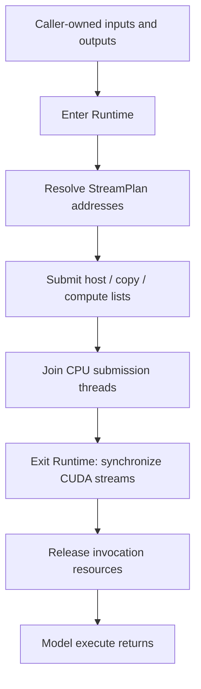

# Runtime: resources, submission, and completion

[中文](../../zh/core/runtime.md) · [Core overview](README.md)

The runtime consumes an addressed `StreamPlan`: three ordered action lists and
their numbered dependencies. It keeps the buffers, checkpoint paths, and
synchronization objects alive while those actions execute. The package boundary
is [runtime/__init__.py](../../../src/nano_omni/core/runtime/__init__.py); it does
not create a runtime or allocate CUDA resources on import.

Read this page from resource ownership through submission, then follow the
buffer and observation helpers used by pipelines. Kernel preparation, native
caches, and CUDA binding are covered in [Compilation](compilation.md).

## Two resource lifetimes

[execution.py](../../../src/nano_omni/core/runtime/execution.py) contains both the
pipeline-wide `CudaRuntime` and the shorter `Runtime` for one model invocation.
Both use `DEVICE TensorDesc` values for addressed byte ranges. The runtime or
pipeline that created an allocation retains ownership.

`CudaRuntime` receives a device ordinal, synchronization settings, and optional
pinned-host and device-workspace capacities. Construction retains the device's
primary CUDA context, makes it current, and creates three nonblocking streams:
`memmove`, `copy`, and `compute`. It also owns a `HostTransfers` pool.
An `ExitStack` registers resources as they are acquired, so partial construction
can release resources acquired before an error.

Entering `CudaRuntime` allocates its configured pinned arena and shared device
workspace. Its `total_memory` property queries total device memory, not the free
capacity remaining after those allocations. `synchronize(stream)` waits for one
CUDA stream. `release_workspace()` and `restore_workspace()` explicitly free and
recreate the shared workspace; neither is a replacement for completing its users
first. Normal context exit attempts to synchronize every stream before cleanup
frees the arenas, destroys streams, releases the primary-context reference, and
closes the host-transfer pool.

`Runtime(cuda, inputs, outputs, paths, workspace_nbytes)` binds one invocation:

1. It retains the checkpoint paths used by host transfer commands.
2. It borrows `cuda.workspace`. A model request must not exceed its `num_bytes`,
   and the pipeline must create the shared workspace before model execution.
3. It installs itself in a `ContextVar`. `current()` supplies this state to address
   resolution and submission. Nested invocation contexts are rejected.

The caller owns `inputs` and `outputs`. Address resolution uses their pointers,
the workspace base, and the pinned base. A file source retains its file index and
byte offset; `HostTransfers` reads that range when the host action executes.

On exit, `Runtime` synchronizes all three streams before destroying its events
and freeing mapped signal storage. The
shared workspace remains owned by `CudaRuntime`. The context-local
runtime binding is cleared even if cleanup raises.

For a normal model call, the sequence is:

## Three lists and three submission threads

[submission.py](../../../src/nano_omni/core/runtime/submission.py) implements
`run(plan)`, reached through `execution.run()`. The input plan already has its
actions partitioned and its dependencies validated by planning. Each numbered
signal has one producer and a set of consumer streams; publishing the same
signal again is not the mechanism for looping over model steps.

The runtime creates one Python thread for each list:

| Plan list | Thread and selected stream | Work issued in list order |
| --- | --- | --- |
| `host` | `submit-memmove`, `memmove` | Complete H2H fills, wait before host reuse, publish host progress. |
| `copy` | `submit-copy`, `copy` | Submit H2D transfers and their dependency operations. |
| `compute` | `submit-compute`, `compute` | Submit `Kernel` instances and compute-side D2D copies and dependencies. |

Each worker receives a copied Python context, makes the same CUDA context
current in its own thread, and sets its own `_active_stream`.

A `Kernel` instance calls its base `submit()` method with addressed arguments.
`launch_tilelang()` converts their `TensorDesc` leaves to raw pointers and invokes
the already compiled launcher on the selected stream. Handles are cached per adapter, and kernel attributes are cached by
their actual arguments. Every Kernel is compiled and bound before execution.
During binding, a separate `FunctionType` receives a
copy of the launcher's globals containing launch/TMA stubs; ordinary execution
keeps the original launcher and its real CUDA APIs. The compilation page explains
the preparation and binding phases in detail.

## What a dependency waits for

`Signal.submitted` is a Python `threading.Event`. It means that the producer has
issued the signal's CUDA publication APIs. It does **not** mean that the producer's
GPU work has completed. A consumer first waits for `submitted`, then performs
the appropriate CUDA wait. This ordering prevents it from waiting on a CUDA event
whose record operation has not yet been submitted.

The four configurable dependency directions are:

| Direction | Configuration field and default | Meaning for the consumer |
| --- | --- | --- |
| Host fill → H2D copy | `host_to_copy="value32"` | The copy stream waits until the pinned input has been filled. `event` is also supported. |
| H2D copy → host reuse | `copy_to_host="event_sync"` | The host thread synchronizes the copy's CUDA event before overwriting the pinned region. |
| H2D copy → compute | `copy_to_compute="value32"` | The compute stream waits until uploaded weights are ready. `event` is also supported. |
| Compute → H2D copy | `compute_to_copy="event"` | The copy stream waits until compute has finished reading a device region that will be reused. `value32` is also supported. |

Event mode creates a timing-disabled CUDA event. The producer enqueues
`cuEventRecord`; a GPU consumer enqueues `cuStreamWaitEvent`. The host consumer
uses `cuEventSynchronize`, since the next CPU memory write must wait for actual
completion rather than merely enqueue a GPU dependency.

Value32 mode allocates one mapped 32-bit word for each signal that needs it.
The words start at zero. The producer stream enqueues `cuStreamWriteValue32(...,
1)` after its preceding work, and the consumer enqueues a wait for equality to
one. `Runtime` owns the mapped allocation until stream synchronization on exit;
the words are not reset and reused for later publications within this plan.

There is one deliberate shared-event case: when a copy signal has both host and
compute consumers, the runtime uses the same CUDA event for both, even when
`copy_to_compute` requests value32. The host already needs an event to synchronize
before pinned-buffer reuse, so this case does not publish a second flag.

`RecordEvent` sets the CPU `submitted` event only after enqueueing the required
GPU signal operations. Each worker retains its list order, but different lists
may progress concurrently. If a worker fails, it records the exception and wakes
all CPU signal waiters so they can notice the error. `run()` joins the workers and
rethrows the first recorded worker failure; already submitted GPU work is drained
by the surrounding `Runtime` cleanup.

Consequently, returning from `submission.run()` establishes **CPU submission
completion**. Returning from the enclosing model `execute()` additionally includes
the `Runtime` exit synchronizations and establishes **GPU completion** for that
invocation. Code that calls the lower-level submission function directly must
retain that distinction when reading or reusing output storage.

## Host fills and asynchronous device copies

The submission loop dispatches an `Copy` according to its kind. H2H
work completes on the host submitter before it advances. H2D uses
`cuMemcpyHtoDAsync`; D2D uses `cuMemcpyDtoDAsync` on the action's selected stream.
Their API returns describe submission, with completion ordered by the dependency
operations above. Planned submission has no D2H copy branch.

[host.py](../../../src/nano_omni/core/runtime/host.py) implements the synchronous
host side through `HostTransfers`:

- `read(path, offset, destination, nbytes)` fills a destination directly from a
  checkpoint byte range. It uses at most eight workers and a 1 MiB-per-worker
  threshold. A single chunk is read directly when parallelism would not help.
- `read_chunk()` caches an unbuffered file handle per worker and path, seeks to
  the requested offset, and continues `readinto()` until all bytes are present.
  A premature end of file raises `EOFError`.

`read()` waits for all futures and propagates their errors before returning.
This is why the host list can publish its fill signal immediately afterward.
Every H2H action is a file-source staging fill. Cached file handles belong to
`CudaRuntime`'s `HostTransfers`; `close()`
waits for the worker pool and then closes its handles.

For one reused staging region, trace the cycle as: host fill → publish → H2D
wait/copy → publish → host completion wait → next host fill. A device weight
region also needs the compute → copy dependency before its next upload.

## Pipeline buffers and media boundaries

[buffers.py](../../../src/nano_omni/core/runtime/buffers.py) owns buffers that live
across model calls. `PipelineMemory` creates its `CudaRuntime` on entry, optionally
checks a VRAM-fraction budget, and returns `DEVICE TensorDesc` values directly.
Allocation sizes stay in `capacities`, while reusable allocation addresses stay
in `inactive`; neither allocator property is stored in the descriptor.

`empty(shape, dtype)` first reuses an inactive allocation with sufficient capacity;
otherwise it checks the budget and allocates a new CUDA buffer. The bytes are not
initialized. A reused allocation may be larger than its new logical view.
`upload()` makes a contiguous NumPy source and performs a host-to-device copy;
`download()` allocates a NumPy result and performs a device-to-host copy.
`concatenate_rows()` checks matching trailing shapes and dtypes, allocates the
combined result, and copies each input into its row range with D2D operations.

`release()` only marks the descriptor's allocation inactive. It does not synchronize or free the
allocation. Callers must finish the previous users before allowing `empty()` to
reuse it. `trim()` synchronizes all runtime streams, frees inactive allocations,
and leaves active buffers and the shared model workspace in place. Context exit
similarly completes stream users before freeing the whole pool and closing
`CudaRuntime`.

The shared workspace is a separate capacity from pooled stage buffers. A model's
workspace request must fit that actual arena as well as its configured limit;
passing total device memory to planning does not enlarge a shared arena.
`check_capacity()` checks current device usage plus a new allocation against the
optional budget. It does not free inactive buffers or change model layouts.

Media code chooses whether an output crosses back to the CPU. The H3 video stage
passes the decoder's device NV12 view directly to NVENC and returns compressed
packets. `decode_video()` synchronizes the compute stream before calling NVENC,
because the external encoder does not participate in the StreamPlan dependency
graph. That view borrows workspace storage, so encoding consumes it before a
later model can overwrite the arena. The audio stage uses `download()` for the
decoded waveform before muxing. Buffer helpers perform transfers and manage
ownership; codecs, tensor layouts, and color conversion remain model/pipeline
responsibilities.

## Timing and working-set observations

[observation.py](../../../src/nano_omni/core/runtime/observation.py) exposes
`record_timing()` and the `stage()` context manager. `record_timing(name, started,
finished, **details)` accepts `perf_counter()` timestamps and writes a JSON record
containing relative start/end seconds, duration, thread name, and the supplied
details. It prints a `timing=` line and, when `NANO_OMNI_TIMING_OUTPUT` is set,
appends a JSON line under a process-local lock.

The origin is `NANO_OMNI_PROCESS_START_NS` when supplied; otherwise it falls back
to this module's import-completion timestamp. These are elapsed-time coordinates,
not calendar timestamps. `stage(name, working_set_threshold)` enters the platform
working-set guard, observes its peak, and records timing in a `finally` block
around the stage body. Its `peak_tree_rss` output measures the observed process
tree's resident host memory, not CUDA allocation size.

The observer does not synchronize CUDA itself. A stage surrounding a complete
model call includes that call's completion waits; a stage surrounding submission
alone measures the work inside that narrower boundary. Use those boundaries when
comparing host planning, transfer submission, GPU execution, and complete media
generation timings.
