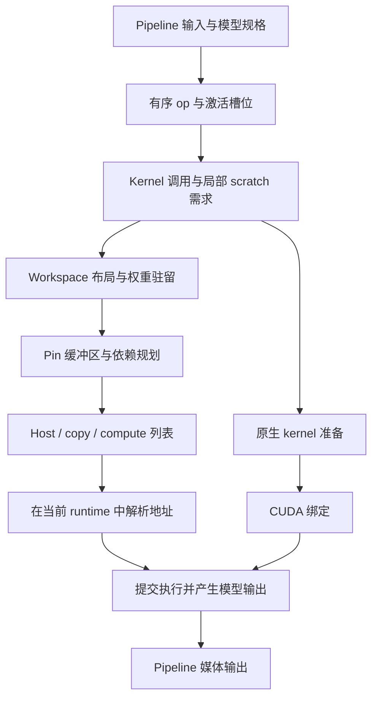

# Core 架构

[English](../../en/core/README.md)

`core` 连接 kernel、op、model 和 pipeline 四层。通过这些公共契约，模型先描述计算与内存需求，再结合具体的权重文件、主机缓冲区和 CUDA 地址执行计划。

四层分别负责不同范围的工作：

| 层级 | 负责的内容 | 产物 |
| --- | --- | --- |
| Kernel | 一项计算、对应的 workload 和编译配置 | 配置后的调用与 MMA 运算次数 |
| Op | 激活绑定、权重绑定和临时区域 | 有序的 kernel 调用与 scratch 大小 |
| Model | 模型形状、激活槽位、有序 op 和权重元数据 | 内存计划与三条有序提交列表 |
| Pipeline | 输入准备、模型协调和媒体输出 | 生成的媒体及测量 workload 描述 |

## 从一次生成看流程

Pipeline 先准备素材并确定输入形状。各个 model 根据形状组织 op，并确定激活槽位大小。每个 op 展开为 kernel 调用，其参数引用激活切片、权重和局部 scratch。规划阶段安排这些区域的位置、权重上传时机及复用依赖。执行阶段将计划位置解析成实际地址，然后提交工作。

提交列表属于模型计划的一部分。Kernel 准备可以提前进行；pipeline 可以在前一个模型执行时准备后续模型。Runtime 持有整次生成所用的 CUDA context 和共享内存区域，每次模型调用则绑定本次输入、输出和权重文件路径。

## 阅读顺序

1. [契约](contracts.md)介绍公共接口、绑定语法、抽象方法、准备结果与运算计数。新增 kernel、op、model 或 pipeline 时从这里开始。
2. [存储](storage.md)解释激活 ID、字节偏移、权重引用和 scratch 大小如何参与 workspace 布局。
3. [规划](planning.md)说明权重驻留、pin 缓冲区、依赖区间及三条提交列表的构建。
4. [编译](compilation.md)说明原生 TileLang 准备、CUDA 绑定以及它们与执行的配合。
5. [运行时](runtime.md)介绍缓冲区所有权、流提交、同步和资源清理。

修改模型时，可以结合契约和存储两页阅读：model 决定激活如何复用，op 提供规划需要的形状与局部临时空间需求。调查启动耗时或同步问题时，可以沿准备流程读到编译，再检查运行时资源的所有权。

## 单位与边界

Tensor 的 shape 以元素计数。激活偏移、scratch 偏移、权重文件偏移和内存容量均以字节计数。Kernel 的 workload/configuration 选择计算变体，执行时再提供设备地址。

模型计划在 kernel command 中保留逻辑运算次数。测量代码将这些次数与硬件吞吐及实测延迟结合，使执行、单 kernel 测量和 pipeline 报告使用相同的 workload 描述。

`core/kernel.py` 定义完整的 MMA 指令类型和逻辑
运算次数。每个类型同时标明两个输入与 accumulator，报告直接使用枚举值。
