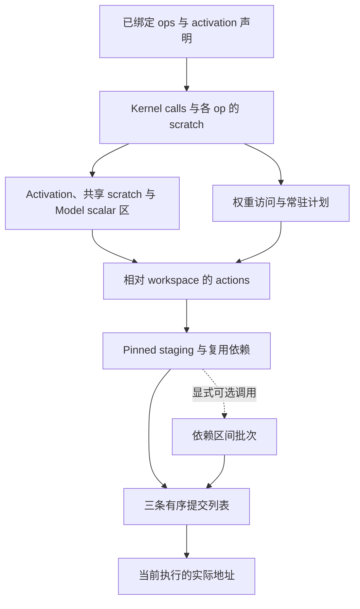

# 分配与规划

[English](../../en/core/planning.md) · [Core 导读](README.md)

从一个已绑定的 `Op` 开始：inputs 标识 activation 切片，weights 保存 registry
引用，`to()` 完成输出绑定。`Op.prepare()` 返回有序的 `Kernel 实例` 和该 op 的
scratch 大小。planning 将这些描述变成复制、kernel 和同步 action，组织成三条
提交列表，最后结合一次执行实际使用的 buffer 解析地址。

下文的容量、复制长度和存储偏移均以**字节**计，tensor shape 仍以元素个数计。
**kernel 序号**、**H2D 使用序号**和 **action 列表下标**分别对应不同序列；各阶段
会显式记录它们之间的关系。



默认模型路径在模型规划时调用 `operators.commands()`；
`PlannedModel.read()` 收到 `pinned_nbytes` 时调用
`scheduling.plan_staging()`；模型构造时调用 `submission.build()`。
`execute()` 进入 runtime 后调用 `addressing.address_plan()`。下文介绍的 batching
接口可由调用方显式插在提交列表构建之前；当前模型 read 路径没有调用它。

## Workspace 布局与 op 降低

阅读 [`operators.py`](../../../src/nano_omni/core/planning/operators.py) 时，先看
`commands(operators, activations, registry, capacity, scalars)`。它返回
`(list[Action], CommandStatistics)`。

函数先按顺序 prepare 所有 op，取得 activation 布局，再将最大的 op scratch
需求向上对齐到 256 字节。各 op 的 kernel 保持 compute stream 内的执行顺序，
因此它们可以使用同一个 scratch 基址。可选的 `ScalarLayout` 打包 Model 构造的
小型只读值，并将每个去重后的区域上传一次。剩余 workspace 作为权重区：

```text
activation 区：[0, activation_bytes)
scratch 区：   [activation_bytes, scalar_base)
scalar 区：    [scalar_base, weight_base)
权重区：      [weight_base, capacity)
scalar_base = activation_bytes + aligned(max_op_scratch, 256)
weight_base = scalar_base + aligned(scalar_bytes, 256)
```

`weight_base >= capacity` 会抛出 `MemoryError`；该入口要求保留正的权重区容量。
随后将所有 prepared calls 展平，交给权重规划器生成上传记录，以及每个 kernel
执行时的权重绑定表。

`arguments.map(bind)` 将具有四种逻辑 `TensorKind` 的 `TensorDesc` 叶节点变成
携带 workspace 相对偏移的 device 描述：

| Kind | Workspace 偏移 | 检查范围 |
| --- | --- | --- |
| `ACTIVATION` | activation 槽位基址 + activation 切片偏移 | 该槽位声明的字节范围 |
| `SCRATCH` | activation 总字节数 + op 内 scratch 偏移 | 共享 scratch 区大小 |
| `SCALAR` | scalar 区基址 + Model scalar 偏移 | scalar 区大小 |
| `WEIGHT` | 权重区基址 + 当前 kernel 的常驻权重偏移 + 引用偏移 | 对应 registry entry 的字节范围 |

视图长度由 dtype 和 shape 计算。相对偏移为负，或视图末端超过所属区域时，函数
触发断言。其他参数值沿用原值。此时记录的是布局偏移，绝对 device
pointer 在执行绑定阶段解析。

`after_kernel = -1` 的上传放在初始上传前缀中；其他上传先等待复用边界上的
compute publication，再覆盖权重区。每次上传完成后发布 copy event，首次消费
该常驻内容的 kernel 等待此 event。compute event 使用 kernel 序号，上传 event
从 kernel 总数开始编号，两组编号分开。

统计结果包含 activation/scratch/scalar 字节数、以 `weight_bytes` 表示的**可用权重区
预算**、实际数据的上传字节数与次数、kernel 数量，以及 activation 槽位偏移。
模型可用这些槽位偏移补充输入、输出复制。

## 权重依赖与最远下次使用淘汰

[`weights.py`](../../../src/nano_omni/core/planning/weights.py) 实现
`plan_weights(calls, entries, capacity) -> WeightPlan`。
`WeightPlan.uploads` 描述建立常驻内容所需的上传，
`bindings[kernel 序号]` 则将该 kernel 使用的 weight ID 映射到权重区内的字节偏移。

规划器遍历 `call.arguments.values()`，取出 `TensorDesc`，并在单次 call 内按首次
出现顺序对 ID 去重。同一 registry entry 的多个视图共享一次常驻需求。上传范围
覆盖整个 entry；具体引用中的偏移在绑定 kernel 参数时再加上。

future-use 队列记录每个 ID 接下来会被哪些 kernel 使用。常驻记录保存
`(offset, aligned_length, last_kernel_use)`。分配时选择第一个能容纳数据的空闲
区间，并将申请长度向上对齐到 256 字节；`Upload.nbytes` 仍保留实际数据长度。
若没有足够大的区间，规划器淘汰下次使用最远的常驻权重；后面不再使用的权重
排在所有剩余 kernel 之后。当前 kernel 所需的所有权重都受保护。受保护的工作集
无法装入时，抛出的 `MemoryError` 包含 kernel 序号和权重区容量。

堆条目携带常驻版本号，用于跳过旧优先级。每个 kernel 处理完后，规划器更新
最后使用序号、递增版本号，并加入新的下次使用优先级。释放后的相邻空闲区间
会合并，因此可能通过多次淘汰获得所需的连续范围。

每条 `Upload` 都包含 `after_kernel` 与 `before_kernel`。前者来自历次淘汰权重的
最后使用序号的单调最大值，是保守的复用边界；后者是首次需要这次常驻内容的
kernel。operator 降低阶段据此安排“何时可以覆盖 workspace”和“哪个 kernel
必须等待上传”。

## Host 字节分段与 pinned 区间

[`staging.py`](../../../src/nano_omni/core/planning/staging.py) 提供共用的空闲区间
函数，以及 `allocate_staging(keys, capacity)`。输入是按 H2D 使用顺序排列的
`(FILE TensorDesc, nbytes)`。`FILE TensorDesc` 给出 checkpoint 文件编号和起始字节偏移，
长度共同决定一个 host 分段的身份；起点相同而长度不同的范围是不同缓存项。
checkpoint 的行分区可在此前通过独立 registry entry 表达。

返回列表与 H2D uses 一一对应。`StagingAllocation.offset` 是 pinned 字节偏移，
`fill` 表示该 host 分段是否需要重新读取，`evicted` 保存被覆盖缓存项最后一次
H2D 使用的序号。命中缓存时复用原偏移并返回 `fill=False`。未命中时，分配器
寻找第一个足够大的空闲区间，必要时淘汰缓存、合并空闲区间，直到整个分段能够
放入。每个分段必须装入 pinned 容量；单次 use 超过容量会抛出 `ValueError`，
需要在进入此分配器前完成分区。

pinned 缓存淘汰选择最远的 `next_use`，其中序号按 H2D uses 计。后续不再使用
的分段排在所有剩余 uses 之后。`EvictionQueue` 替换某个 key 的下次使用优先级，
跳过旧堆条目，并定期压缩堆。缓存中的 `last_use` 仅用于确定 pinned 区间复用前
必须完成的 H2D 读取。分配器记录这些旧传输的序号，随后由 scheduling 将它们
转成同步 action。

`allocate_interval()` 从首个可容纳请求的空闲区间头部取出空间；
`release_interval()` 对归还区间排序并合并相邻范围。调用方负责提供合法且互不
重叠的分配；权重规划器在申请长度时施加其对齐要求。

## 将 staging 分配变成依赖

[`scheduling.py`](../../../src/nano_omni/core/planning/scheduling.py) 定义
`Copy`、`RecordEvent`、`WaitEvent`，以及它们与
`Kernel 实例` 组成的 `Action` 联合类型。符号复制端点带有标签：
`input`/`output` 的数值表示 runtime buffer 槽位，`workspace`/`pinned` 的数值
表示字节偏移，`weight` 携带 `FILE TensorDesc`，`constant` 携带原始 bytes。

`extract_h2d_uses()` 选出符号形式的 `weight -> workspace` 复制。
每个 `H2DUse` 保留原 action 下标、连续的 H2D 序号、源分段、目标偏移、字节数
和 stream。`plan_staging()` 为这些 uses 取得 pinned 分配，再将所选上传替换成
`pinned -> workspace` 复制。其他 action 保持原有次序。

需要 fill 时，调度器依次插入 `memmove` stream 的复用等待、
`weight -> pinned` 主机复制、ready publication，以及上传 stream 对 ready 的
等待。缓存命中时，已有序的上传继续读取相同的 pinned 内容。发生淘汰时，旧
H2D 读取之后会增加 release publication，主机重新写入前必须等待这些读取
完成。被淘汰缓存项的最后使用按**生产 stream**归并，每条 stream 只保留最新的
一次；跨不同生产 stream 的完成关系各自保留。

新 event ID 从所有既有非负 record/wait ID 之后开始。没有匹配权重上传的 action
列表原样返回。`host_transfer_statistics()` 对比请求的 H2D uses 与实际 pinned
fills，统计唯一分段、fill 字节数、缓存命中字节数以及 action 数量。这些数值
描述规划出的传输，实际主机读取与 device copy 由 runtime 执行。

## 三条提交列表

[`submission.py`](../../../src/nano_omni/core/planning/submission.py) 的入口为
`build(actions) -> StreamPlan`。kernel 进入 `compute`；复制和 event action
按自己的 `stream` 字段分配。支持的 stream 名称是 `memmove`、`copy`、
`compute`，返回结果的 `host` 列表承载 `memmove` actions。

每个 action 按遇到的顺序进入目标列表一次。依赖表将 event ID 映射到一个生产
stream 和去重、排序后的消费 streams。每个 event 只能发布一次，且 publication
必须在输入 action 列表中先于所有 waits；重复发布或先等待后发布都会抛出
`ValueError`。三条列表直接保留 record/wait actions，由 runtime 按配置选用的
同步机制解释。

## 解析一次执行的地址

[`addressing.py`](../../../src/nano_omni/core/planning/addressing.py) 在已激活的
runtime 内执行 `address_plan(StreamPlan) -> StreamPlan`。它分别解析三条列表，
并沿用同一份依赖表。空 plan 也要求已有 runtime 绑定。

`Arguments.map(device)` 只重建一次 kernel 参数 dataclass。`INPUT`、
`OUTPUT` 和 `WORKSPACE` descriptor 选择对应 runtime buffer，随后变为
包含基地址和字节偏移的 `DEVICE` descriptor。每个范围都会按 buffer
容量校验。

`address_action()` 将符号复制转成 `Copy`：取得当前 input/output pointer，并加上
workspace 或 pinned 偏移。常量取得主机地址，其 owner 保留在解析后的命令中。
文件来源保留文件序号和字节偏移，供 `HostTransfers.read()` 使用，不再取得映射
主机地址。解析结果按端点分为 H2H、H2D 或 D2D。kernel 参数走同样的递归地址
解析，record/wait actions 保持原对象。

## 串起各阶段的小例子

假设权重区有 512 字节，A、B、C 各占 256 字节，四个 kernel 的需求依次是
`K0(A), K1(B), K2(C), K3(A)`。A、B 最初占用偏移 0 和 256。处理 K2 时，B
以后不再使用，而 A 还要给 K3 使用，因此 C 替换 B。C 的上传记录得到
`after_kernel=1`、`before_kernel=2`：copy 等待 K1 后才能覆盖偏移 256，K2 等待
C 的 copy 完成后才能读取。若 pinned 区只有 256 字节，A、B、C 还必须依次复用
pinned 偏移 0。B 的主机 fill 等待 A 的 H2D 读取完成，C 的 fill 同理等待 B。
这些复用边使 batching 调用方无法跨中间的主机 fill 将 A、B 合为一组，因为
它们在 host stream 上的合法区间交集为空。submission 将这些依赖保留在三条
列表之间。执行时，权重区内偏移 256 解析为
`workspace_pointer + weight_base + 256`，pinned 偏移则基于本次 pinned pointer
解析。

## 包入口

[`__init__.py`](../../../src/nano_omni/core/planning/__init__.py) 为该包提供分配、
调度和地址绑定的范围说明。具体入口位于上面的子模块中，调用方直接导入相应
子模块或函数。
