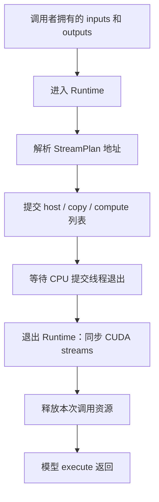

# Runtime：资源、提交与完成

[English](../../en/core/runtime.md) · [Core 总览](README.md)

Runtime 接收已解析地址的 `StreamPlan`：三条有序 action 列表及其编号依赖，并在
这些 action 执行期间维持 buffer、checkpoint 路径和同步对象的生命周期。
[runtime/__init__.py](../../../src/nano_omni/core/runtime/__init__.py) 声明这个包的
边界；导入该文件不会创建 runtime 或分配 CUDA 资源。

可以先沿本页阅读资源所有权与提交过程，再看 pipeline 使用的 buffer 和观测接口。
Kernel 预准备、缓存和 CUDA 绑定详见[编译](compilation.md)。

## 两层资源生命周期

[execution.py](../../../src/nano_omni/core/runtime/execution.py) 同时定义贯穿 pipeline
的 `CudaRuntime`，以及只覆盖一次模型调用的 `Runtime`。两层都使用 `DEVICE
TensorDesc` 表达已寻址的字节范围，allocation 的所有权仍由创建它的 runtime 或
pipeline 持有。

`CudaRuntime` 接收设备 ordinal、同步配置，以及可选的 pinned host 和 device
workspace 容量。构造时，它保留设备的 primary CUDA context，将其设为当前 context，
并创建 `memmove`、`copy`、`compute` 三条 nonblocking stream。
它还拥有一个 `HostTransfers` 线程池。资源每取得一项就登记到 `ExitStack`，因此
构造中途失败时能够释放此前已经取得的资源。

进入 `CudaRuntime` 上下文后，才按配置分配 pinned arena 和共享 device workspace。
`total_memory` 查询设备总显存，不是扣除这些分配后的剩余可用量。
`synchronize(stream)` 等待指定 CUDA stream 完成。`release_workspace()` 和
`restore_workspace()` 显式释放、重新分配共享 workspace；调用者仍需先完成对该
workspace 的使用。正常退出会先尝试同步所有 stream，再释放 arena、销毁 stream、
释放 primary context 引用，并关闭 host transfer 线程池。

`Runtime(cuda, inputs, outputs, paths, workspace_nbytes)` 绑定一次模型调用：

1. 保留主机传输命令所需的 checkpoint 路径。
2. 借用 `cuda.workspace`。模型请求的字节数不得超过它的 `num_bytes`；pipeline
   必须在进入模型调用前创建共享 workspace。
3. 将自身安装到 `ContextVar`。地址解析和提交通过 `current()` 取得当前状态；
   不允许嵌套进入模型调用上下文。

`inputs` 和 `outputs` 仍由调用者拥有。地址解析根据这些 buffer 的地址、workspace
基址和 pinned 基址生成具体地址。文件来源保留文件序号和字节偏移，由
`HostTransfers` 在主机 action 执行时读取。

退出 `Runtime` 时，先同步全部三条 stream，再销毁该调用的 event 并释放 mapped
signal 内存。共享 workspace 由 `CudaRuntime`
保留。即使清理抛出异常，上下文中的 runtime 绑定也会被清除。

普通模型调用依次经过：

## 三条列表与三个提交线程

[submission.py](../../../src/nano_omni/core/runtime/submission.py) 实现 `run(plan)`，
由 `execution.run()` 转入。输入计划已经在 planning 阶段完成 action 分流和依赖
验证。每个编号 signal 有一个 producer 和若干 consumer stream；反复发布同一
signal 不是这个接口表达模型多步执行的方式。

Runtime 为每条列表创建一个 Python 线程：

| 计划列表 | 线程及选中的 stream | 按列表顺序发出的工作 |
| --- | --- | --- |
| `host` | `submit-memmove`、`memmove` | 完成 H2H 填充，在 host 复用前等待，发布 host 进度。 |
| `copy` | `submit-copy`、`copy` | 提交 H2D 传输及其依赖操作。 |
| `compute` | `submit-compute`、`compute` | 启动 `Kernel 实例`，提交 compute 侧 D2D 拷贝及依赖操作。 |

每个线程取得一份 Python context，在本线程设置同一个 CUDA context 为当前值，
并设置自己的 `_active_stream`。

`Kernel` 实例使用已解析的参数调用基类 `submit()`。`launch_tilelang()` 将其中的
`TensorDesc` 叶节点转换为原始指针，再通过已编译 launcher 向当前 stream 发起调用。Kernel handle 按 adapter 缓存，kernel
attribute 按实际参数缓存。每个 Kernel 都在执行前完成编译和绑定。
绑定期间，独立的 `FunctionType` 使用 launcher globals 的副本，其中替换为
launch/TMA stub；正常执行仍使用原 launcher 及其真实 CUDA API。预准备与绑定的
完整过程由编译章节说明。

## 一条依赖究竟在等待什么

`Signal.submitted` 是 Python 的 `threading.Event`。它表示 producer 已经调用
对应的 CUDA signal 发布 API，**不表示 producer 的 GPU 工作已经完成**。
Consumer 先等待 `submitted`，再执行相应的 CUDA 等待。这样可以避免消费者对
尚未提交 record 的 CUDA event 发出等待。

四个可配置的依赖方向如下：

| 方向 | 配置字段与默认值 | Consumer 等待的条件 |
| --- | --- | --- |
| Host 填充 → H2D copy | `host_to_copy="value32"` | Copy stream 等待 pinned 输入填充完成；也支持 `event`。 |
| H2D copy → host 复用 | `copy_to_host="event_sync"` | Host 线程同步 copy 的 CUDA event，之后才允许覆盖该 pinned 区域。 |
| H2D copy → compute | `copy_to_compute="value32"` | Compute stream 等待上传的权重就绪；也支持 `event`。 |
| Compute → H2D copy | `compute_to_copy="event"` | Copy stream 等待 compute 不再读取即将复用的 device 区域；也支持 `value32`。 |

Event 模式创建禁用计时的 CUDA event。Producer 排入 `cuEventRecord`，GPU
consumer 排入 `cuStreamWaitEvent`。Host consumer 使用 `cuEventSynchronize`，
因为下一次 CPU 内存写入必须等待真实完成，仅排入 GPU 依赖还不够。

Value32 模式为每个需要它的 signal 分配一个 mapped 32 位整数，初值为零。
Producer stream 在此前工作之后排入 `cuStreamWriteValue32(..., 1)`，consumer
排入等待值等于一的操作。Mapped 分配由 `Runtime` 持有到退出时的 stream 同步
完成；同一计划内不会把这些整数清零，再用于下一次 signal 发布。

有一个明确的共用 event 情况：copy signal 同时被 host 和 compute 消费时，两者
都使用同一个 CUDA event，即使 `copy_to_compute` 配置为 value32。Host 为了
复用 pinned buffer 已经需要 event，此时不再额外发布一个 flag。

`RecordEvent` 在所需 GPU signal API 全部入队后才设置 CPU `submitted` event。
每个 worker 保持自身列表顺序，不同列表可以并发推进。Worker 失败时记录异常，
并唤醒所有 CPU signal 等待者，使其发现错误并退出。`run()` 等待线程结束后重新
抛出首先记录的 worker 异常；已经入队的 GPU 工作由外围 `Runtime` 清理阶段等完。

因此，`submission.run()` 返回只说明 **CPU 提交完成**。外层模型 `execute()`
返回还包含 `Runtime` 退出时的同步，说明该调用的 **GPU 工作完成**。直接调用底层
提交函数的代码，在读取或复用输出内存时必须区分这两个边界。

## Host 填充与异步 device 拷贝

提交循环根据 `Copy.kind` 分派传输。H2H 在 host submitter 上完成后，
才继续后续 action；H2D 使用 `cuMemcpyHtoDAsync`，D2D 使用
`cuMemcpyDtoDAsync`，都发往该 action 所选的 stream。API 返回表示提交，完成
顺序由前述依赖保证。计划提交循环没有 D2H 分支。

[host.py](../../../src/nano_omni/core/runtime/host.py) 通过 `HostTransfers` 实现
同步的 host 侧工作：

- `read(path, offset, destination, nbytes)` 从 checkpoint 的指定字节区间直接
  填充目标地址。每 worker 的阈值为 1 MiB，最多使用 8 个 worker；不足以受益于
  并行时直接读取单块。
- `read_chunk()` 按 worker 和 path 缓存无缓冲文件句柄，定位到请求偏移后循环
  `readinto()`，直到所有字节读完；提前遇到文件结尾则抛出 `EOFError`。

`read()` 等待全部 future，并在返回前传播错误。所以 host 列表可以在方法返回后
立即发布填充完成的 signal。所有 H2H action 都是文件来源的 staging fill。缓存
句柄属于 `CudaRuntime` 的 `HostTransfers`；`close()` 先等待线程池退出，再关闭句柄。

对于复用的 staging 区域，可以沿着“host 填充 → 发布 → H2D 等待并拷贝 → 发布 →
host 等待完成 → 下一次填充”阅读。Device 权重区域还需要 compute → copy 依赖，
下一次上传才能覆盖它。

## Pipeline buffer 与媒体边界

[buffers.py](../../../src/nano_omni/core/runtime/buffers.py) 管理跨模型调用存活的
buffer。`PipelineMemory` 在进入时创建自己的 `CudaRuntime`，可选择检查显存
占比预算。它直接返回 `DEVICE TensorDesc`；底层分配容量保存在 `capacities`，可复用
状态保存在 `inactive`，不会写入 descriptor。

`empty(shape, dtype)` 优先复用容量足够的 inactive 分配，否则检查预算后新分配
CUDA buffer。它不初始化内容，复用后的逻辑视图可以小于底层分配。
`upload()` 先得到连续的 NumPy 输入，再执行 host-to-device 拷贝；`download()`
分配 NumPy 输出并执行 device-to-host 拷贝。`concatenate_rows()` 检查各输入的
尾部 shape 与 dtype 一致，分配拼接输出，然后以 D2D 拷贝填充各行区间。

`release()` 只把 descriptor 对应的 allocation 标记为 inactive，不同步，也不释放分配。调用者必须先
完成此前的使用，才能让 `empty()` 复用该 buffer。`trim()` 同步所有 runtime
stream 后释放 inactive 分配，保留 active buffer 和共享模型 workspace。
`PipelineMemory` 退出也先完成 stream 使用者，再释放整个 pool 并关闭
`CudaRuntime`。

共享 workspace 与 pool 中的阶段 buffer 是两份不同的容量。模型请求必须同时
满足实际 arena 容量和配置上限；向 planning 传入设备总显存不会扩大共享 arena。
`check_capacity()` 根据当前设备用量加上新分配量检查可选预算，不会自动释放
inactive buffer，也不会改变模型布局。

输出是否回到 CPU 由媒体代码决定。H3 video 阶段将 decoder 返回的 device NV12
视图直接传给 NVENC，得到压缩 packet。NVENC 不参与 StreamPlan 依赖图，因此
`decode_video()` 在调用它之前同步 compute stream。该视图借用 workspace，因此
编码先消费完它，后续模型才能覆盖 arena。Audio 阶段通过 `download()` 取得解码
waveform，再用于 mux。Buffer helper 负责传输和所有权，codec、tensor 布局及颜色
转换由 model/pipeline 负责。

## 计时与 working set 观测

[observation.py](../../../src/nano_omni/core/runtime/observation.py) 提供
`record_timing()` 和 `stage()` 上下文管理器。
`record_timing(name, started, finished, **details)` 接收 `perf_counter()` 时间戳，
写出包含相对起止秒数、耗时、线程名和额外详情的 JSON 记录。它打印 `timing=`
行；设置了 `NANO_OMNI_TIMING_OUTPUT` 时，还会在进程内 lock 保护下追加 JSONL。

起点优先来自 `NANO_OMNI_PROCESS_START_NS`，未设置时使用本模块完成导入的时间。
这些数值是耗时坐标，不是日历时间。`stage(name, working_set_threshold)` 进入
平台 working-set guard，观察峰值，并在包围阶段主体的 `finally` 中记录时间。
打印的 `peak_tree_rss` 表示被观察进程树的 host 驻留内存，不是 CUDA 分配量。

观测器本身不会同步 CUDA。包住完整模型调用的 stage 会包含调用内部的完成等待；
只包住提交过程时，测到的就是较窄边界内的工作。比较 host planning、传输提交、
GPU 执行与完整媒体生成时间时，应明确采用的是哪个边界。
